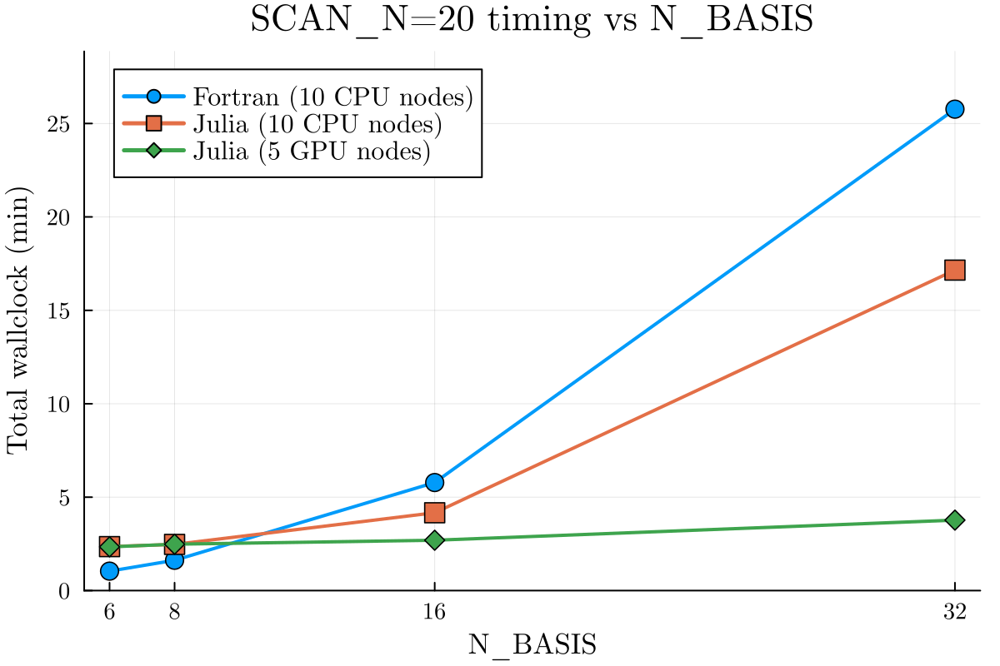

# TJLFEP.jl

A Julia port of **TGLF-EP**, the energetic-particle (EP) critical-gradient
threshold model built on top of [TJLF](https://github.com/ProjectTorreyPines/TJLF.jl)
(the Julia port of TGLF). TJLFEP scans a scale factor on the EP pressure gradient
until a marginally unstable Alfvénic mode appears, yielding the critical EP
density/pressure gradients used for EP transport and stability studies.

It is a close, jointly-maintained translation of the Fortran GACODE add-on
`TGLF-EP` — verified against it bit-for-bit — and adds a CUDA GPU eigensolver path
that is **~6.8× faster than the Fortran CPU reference** at production basis size
(`N_BASIS=32`).

## Capabilities

1. **Verification against Fortran TGLF-EP** — run the same case through the
   canonical Fortran `TGLFEP_driver` and Julia and overlay the results.
2. **Run + validate** on an `input.gacode` + `input.TGLFEP` pair.
3. **Database generation** on GPU (NVIDIA MPS, 1 radius/worker).
4. **Timing vs `N_BASIS`** benchmark (Fortran CPU / Julia CPU / Julia GPU).
5. **Sysimage** build + run (removes JIT cost for production).
6. **FUSE-native IMAS `dd`** path — run from an IMAS data dictionary using the
   same preprocessing/`runTHD` routines as the `input.gacode` path.

## Repository layout

| Path | Contents |
|------|----------|
| `src/` | The TJLFEP package (`module TJLFEP`). |
| `build/` | Run / verify / benchmark / sysimage scripts (see `build/README.md`). |
| `examples/` | Canonical DIII-D and ITER cases (see `examples/README.md`). |
| `utils/` | Preprocessing-comparison utilities (see `utils/README.md`). |
| `test/` | Regression tests, incl. the nb6 Fortran-match fixture. |
| `docs/` | Verification/reproduction notes + benchmark assets. |
| `attic/` | Quarantined development scratch (gitignored, recoverable). |

## Installation

Requires Julia **1.11+** (1.11.7 and the default NERSC `juliaup` Julia 1.12+ are
both fine). TJLFEP depends on registered `TJLF >= 1.2.4` (FuseRegistry); no TJLF
checkout is needed.

```bash
cd TJLFEP
julia --project=. -e 'using Pkg; Pkg.instantiate(); Pkg.precompile()'
```

The GPU path requires **CUDA >= 12.6** (the eigensolver calls `cusolverDnXgeev`).

On HPC systems Julia and CUDA are typically provided as modules (e.g.
`module load julia cudatoolkit/12.9` on Perlmutter, or a pinned
`julia/1.11.7`). If your shared filesystem has a small or slow home directory,
point `JULIA_DEPOT_PATH` at a larger scratch location before instantiating.

## Quick start

```julia
using TJLFEP

# File-based path (set TJLFEP_FILE_ONLY=1 to skip IMAS/FUSE imports):
runTHD("input.TGLFEP", "input.MTGLF", "input.EXPRO"; use_gpu=true)

# Directly from an input.gacode + scan-control input.TGLFEP:
runTHD_from_gacode("examples/DIIID_202017C42_500ms_v3.1/input.gacode",
                   "examples/DIIID_202017C42_500ms_v3.1/input_scan20_nb6.TGLFEP";
                   use_gpu=true)

# FUSE-native IMAS data dictionary (same gradient routines as input.gacode):
runTHD(dd, rho, OptionsDict; use_gpu=true)   # see examples/ITER/ITERstructExample.jl
```

On Perlmutter, the batch wrappers in `build/` drive these on Slurm; start with
`sbatch build/batch_smoke_test.sh` (capability 2). See `build/README.md` for the
full per-capability script index.

## Verification against Fortran

The Julia port reproduces the Fortran `TGLFEP_driver` `SFmin` profile to its
printed precision on the DIII-D `202017C42_500ms_v3.1` case. The verification
scripts default to the shared Fortran build at
`/global/cfs/cdirs/m3739/gacode_add_d3d/TGLF-EP` (override `TGLFEP_DIR`).

```bash
cd build
sbatch batch_debug_nb6_fortran_scan20_10n.sh   # Fortran reference
sbatch batch_debug_nb6_julia_scan20_10n.sh     # Julia
# then overlay:
FORTRAN_DIR=... JULIA_DIR=... FILE_DIR=... ./compare_debug_nb6_scan20.sh
```

Agreement at the scan radii: `SFmin` max relative error ~0.03%; α(dn/dr) ~0.5%.
A self-contained smoke-level regression (`test/runtests_regression_nb6.jl`) checks
one radius against the archived Fortran golden output. Full steps:
`docs/REPRODUCE_FORTRAN_MATCH.md`; physics-parity notes:
`docs/FORTRAN_JULIA_COMPARISON.md`.

## Benchmark: wallclock vs N_BASIS (DIII-D, SCAN_N=20)

20-radius scan on Perlmutter; Fortran CPU (10 nodes) vs Julia CPU (10 nodes,
SlurmClusterManager) vs Julia GPU (5 A100 nodes, MPS team), all with sysimages.



| N_BASIS | Fortran CPU (s) | Julia CPU (s) | Julia GPU (s) | GPU speedup vs Fortran |
|--------:|----------------:|--------------:|--------------:|-----------------------:|
| 6  | 62.5   | 141.3   | 140.4 | 0.45× |
| 8  | 97.5   | 148.4   | 149.0 | 0.65× |
| 16 | 347.0  | 250.0   | 161.7 | 2.15× |
| 32 | 1546.0 | 1029.2  | 226.3 | **6.83×** |

The GPU eigensolver wins decisively as the basis (and therefore the dense
eigenproblem) grows: at the production `N_BASIS=32` it is **6.8× faster** than the
Fortran CPU reference. Data: `docs/img/scan20_timing.csv`. Reproduce with
`build/submit_timing_vs_nbasis.sh` (capability 4).
