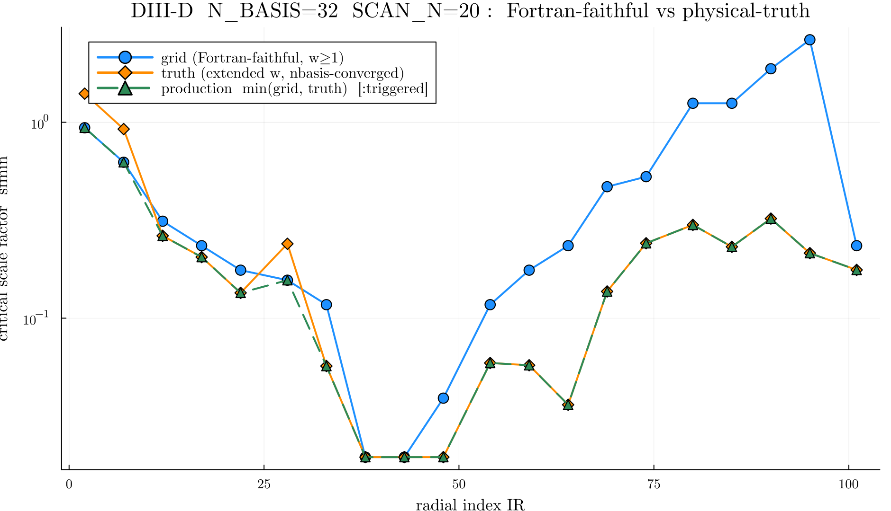
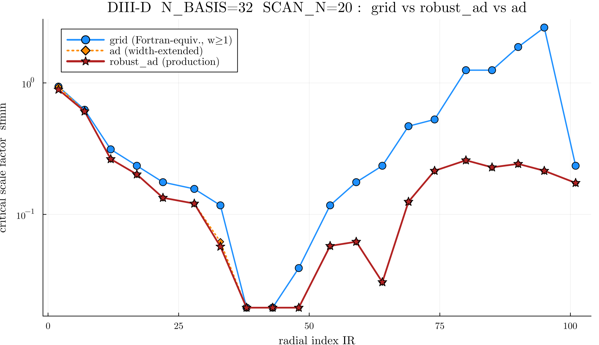

# TGLF-EP critical-factor solvers, accuracy, and the `(kyhat, width)` search bounds

This document records the outcome of a study of the autodiff (AD) critical-factor solvers in
`TJLFEP` and — more importantly — what we learned about the **physical/numerical search bounds**
(`kyhat`, `width`, `nbasis`) while validating them on the DIII-D `n_scan=20`, `nbasis=32` case
(`examples/DIIID_202017C42_500ms_v3.1`). All GPU runs used 1×A100 with an MPS worker team of 4.

The bottom line up front:

- For the **fast production solver**, `adf1` (pinned-aware seed → `:ad` descent → faithful confirm)
  is exact-and-cheap on *clean* and *floor-pinned* radii (most of the profile). The grid-zoom
  `robust_ad` is the trustworthy reference on the *hard* (multimodal/sparse) radii.
- For the **hard near-marginal radii (e.g. IR=48, IR=95)** the *true* critical factor lies at
  **narrow width (`w ≈ 0.1`), below the default `WIDTH_MIN = 1.0`**, and is a real, EP-driven,
  **numerically converged** mode — it is **~10× more unstable** than the in-box value (IR=95:
  `sfmin ≈ 0.21` vs the `w ≥ 1` grid's `~2.64`). See §4.
- The **default search box (`width ∈ [WIDTH_MIN, WIDTH_MAX] = [1,2]`) is a *modeling/faithfulness*
  choice** that matches Fortran TGLF-EP's width floor — **not** a numerical necessity. It keeps the
  scan in a well-conditioned regime, but at near-marginal radii it **biases `sfmin` high by ~10×** by
  excluding genuine narrow-width AEs.

---

## 1. The solver family

All solvers minimise the **faithful** marginal EP scale factor `sfmin` — the factor at which the
leading AE-band growth crosses `γ*` and passes the TGLF-EP keep filters — over `(kyhat, width)`.
`kwscale_scan`/`grid` is the Fortran-equivalent reference.

| Solver | Strategy | Notes |
|--------|----------|-------|
| `:grid` | Fortran `kwscale_scan` `(kyhat × width × factor)` sweep | reference; bit-faithful to Fortran (`w≥1`) |
| `:ad` (`critical_factor_optimize`) | 1 seed → projected-gradient/IFT descent on the cheap AE-onset surface, **width-extended** in the scan path (`extend_width=true`: same log-`w` locate as `:robust_ad`, seeded on the `:ad` descent instead of a faithful grid, `sfmin = min(w≥1 descent, narrow locate)`) | fastest; the extension recovers most of the narrow-width gain over Fortran `w≥1` at no faithful-grid cost; still **blind to floor-pinned basins** / single-basin fragile on the `w≥1` core (less robust than `:robust_ad`). `extend_width=false` → pure `w≥1` |
| **`:robust_ad`** (`critical_factor_robust`) | `w≥1` faithful grid-zoom **+ extended narrow-width locate** (`extend_width=true`: log-`w` down to ~0.05 → `:ad` descent → faithful confirm), `sfmin = min(both)` | **middle ladder rung**: captures the narrow-AE width reduction (2–11×) at `nb=N_BASIS`; `extend_width=false` → pure `w≥1` |
| `:confirm` (`critical_factor_confirm`) | cheap eigenvalue-only `f1` grid search + early-stop few-confirm (shared `_rank_confirm`) | provably exact over the `w≥1` grid; fewer `IFLUX=true` evals. Also available *inside* `:robust_ad` as the **opt-in** `confirm_grid=true` (default **off** — see note) |
| `adf1` (`critical_factor_ad_f1seed`) *(core)* | pinned-aware `f1` seed grid → `:ad` descent on interior basins (+ grid-floor guard) → early-stop confirm | fixes `:ad`'s pinned-blindness; fast canonical pass |
| **`:truth`** (`critical_factor_truth`) *(core)* | **`:robust_ad` (width-extended) + separable nbasis convergence** at the located `(ky,w)` | **top ladder rung**: adds the (adverse) `+nbasis` correction; **NOT Fortran-faithful** (see §5) |
| `critical_factor_triggered` *(core)* | fast `adf1` canonical pass + width-floor/trust trigger → escalate to `:truth`, keep `min` | production policy wrapper |
| `critical_factor_direct` *(experiment)* | NLopt `GN_DIRECT_L` global search on cheap AE-edge + early-stop confirm | most accurate on **dense** surfaces; **fails on sparse** ones |
| `critical_factor_ad_escalate` *(experiment)* | `adf1` default + trust gate → escalate to `:direct` or `:grid` | see §3 |

`adf1`, `critical_factor_truth`, and `critical_factor_triggered` are **promoted to core**
(`src/tjlfep_ad_extensions.jl`, exported) and `:truth` is selectable from `mainsub` /
`run_gacode_scan_task` / the `solver` toggle like `:grid`/`:ad`/`:robust_ad`. The remaining
experiment-only solvers (`critical_factor_direct`, `critical_factor_ad_escalate`) live in
`build/ad/direct_solver.jl` and depend on `NLopt` (in `Project.toml` but **not** imported by the
module, so the production package / sysimage stay NLopt-free).

**`confirm_grid` (opt-in, default `false`).** `critical_factor_robust` can fold the `:confirm`
cheap-rank→few-confirm scheme into its `w≥1` grid passes (shared `_rank_confirm`, forwarded by
`critical_factor_truth`). It is **provably exact for a fixed node set** — verified **bitwise** vs the
brute path with `adaptive=false` across DIII-D IR=2/17/22/95 at `nb=6/8/16` — and cuts `IFLUX=true`
evals (e.g. 780→29 at one radius). It is nonetheless **kept off by default** because, on the GPU/MPS
production route, measurement (20-radius DIII-D 1-node sweep, `nb=6..32`) shows it is **7–18% SLOWER**:
the early-stop confirm loop is inherently serial (each confirm depends on the running incumbent) so it
confirms on **one** GPU while the brute path fans all `nkyhat·nefwid` faithful solves across the whole
MPS team, and the cheap rank adds a full extra eigen-scan pass — i.e. the `IFLUX=true` keep filter is
**not** the per-node bottleneck (the eigensolve is). At `nb=32` it reproduces the brute `sfmin` exactly
(0 rel diff, all 20 radii) yet is ~10% slower — a pure loss there. Separately, with `adaptive=true` its
cheap (over-counted) feasibility count feeds the `sparse` zoom trigger and shifts which refine boxes are
explored, so `sfmin` can differ from the brute path at near-degenerate radii (~3–10% at a couple of
`nb<32` DIII-D radii; exact with `adaptive=false`). Use `confirm_grid=true` for **CPU/serial** runs
(where the keep filter cost matters and there is no team to underutilize) or with `adaptive=false`.

---

## 2. Accuracy comparison (canonical `kyhat ≥ 0.25`, `nbasis=32`)

From the escalation validation (job 54547632), all methods faithful-confirmed, MPS team=4:

| IR | surface | `adf1` | DIRECT-40 | `robust_ad` (grid-zoom) |
|----|---------|--------|-----------|--------------------------|
| 22 | clean        | 0.16182 | 0.16015 | 0.15675 |
| 38 | floor-pinned | 0.019531 | 0.019531 | 0.019531 |
| 48 | dense off-node | 0.054455 | **0.026761** | 0.054455 |
| 95 | sparse       | 5.4907 | **Inf (no_onset)** | 3.8793 |

Reading:

- **Clean / pinned radii (22, 38):** all three agree; `adf1` is fastest (IR=38 ~45 s vs DIRECT
  ~175 s) and is exact on the floor-pinned radius that plain/guarded `:ad` *miss* (their gradient
  objective is blind to floor-pinned instabilities).
- **Dense off-node (48):** DIRECT-40 finds a genuinely lower basin (0.0268, ≈ the dense-grid value
  0.0286) that both `adf1` and `robust_ad` miss (both basin-lock at 0.0545). DIRECT's adaptive
  global sampling is the only method that escapes the wrong basin here.
- **Sparse (95):** DIRECT-40 **fails** — in 40 evals it never lands a confirmable unstable sample
  (the unstable region is ~16% of the box), returning `no_onset`. `robust_ad`'s systematic
  grid+zoom always returns a finite value.

### Is `robust_ad` better than DIRECT-40?

**Neither dominates.** It is a robustness/accuracy trade:

- **`robust_ad`** never fails (always finite), is the production default, but can miss off-node
  minima on dense surfaces (IR=48: +100% vs DIRECT).
- **DIRECT-40** is more accurate on dense surfaces (finds off-node basins) but is **fragile**: on
  sparse surfaces its space-partitioning can return `no_onset` (IR=95), and it costs ~25–50% more
  wallclock. It is also **not** a viable universal escalation target for that reason.

---

## 3. Escalation policy (`critical_factor_ad_escalate`)

`adf1` is the fast default; a cheap **trust gate** escalates only flagged radii:

- `cheap_gap = sfmin / cheap_f1(winner) > 1.5` — keep filters flipped at the descended basin
  (faithful ≫ cheap).
- `feasible_frac < 0.25` — sparse unstable seed grid (multimodal/under-bracketed surface).
- `no_onset` / `cap` — nothing trustworthy found.

Flagged → run the escalation **target** (`:direct` = DIRECT-40, or `:grid` = `robust_ad`) and keep
the lower faithful `sfmin`. Validation (job 54547632) showed two limits worth recording:

1. **DIRECT-40 fails the sparse case (IR=95 → Inf)**, so `:direct` cannot be the universal target;
   `:grid` is required for sparse radii.
2. The cheap gate **does not flag IR=48**: `adf1`'s answer there is locally self-consistent
   (`cheap_gap≈1.0`, `feasible_frac=0.81`) — a *missed basin* with no cheap signal. Detecting it
   cheaply is not possible with a coarse static grid; only adaptive global sampling (DIRECT) finds
   it. This is a genuine limitation, not a tuning issue.

**Practical default:** `adf1` + escalate-to-`:grid` on flagged (sparse/keep-divergent) radii. This
gives `:ad`-class speed on the clean/pinned majority and grid-zoom robustness on the hard radii.

---

## 4. The `(kyhat, width)` search bounds — physics and numerics

While reconciling solver disagreements on the hard radii, we found the disagreements trace to the
**search bounds**, not the optimisers. Key facts:

### 4.1 `kyhat` is physical; its grid "floor" is just sampling
`TJLF_map` unconditionally sets `KY_MODEL=3` (`tjlfep_read_inputs.jl:889`), so for **both** the grid
and AD paths `KY = KYHAT_IN · Z/√(m·T)`. The scan domain is `kyhat ∈ [0,1]`; the grid merely samples
it at `{0.25, 0.5, 0.75, 1.0}` (for `nkyhat=4`). So `kyhat=0.25` is **not** a physical floor.
However, an extended faithful mesh (job 54553260) shows the AE onset **self-limits in `kyhat`**:
it vanishes (stable) below `ky≈0.05` at IR=48 and below `ky≈0.01` at IR=95 — there is no runaway
toward `ky→0`. (An earlier DIRECT result of `sfmin≈1.38` at `ky=0.006` was a sub-`0.01` point that
disappears once the onset is tracked properly.)

### 4.2 `WIDTH_MIN=1.0` truncates more-unstable narrow-width AEs…
Extended faithful meshes (jobs 54553260, 54557433) stepping **below** `WIDTH_MIN=1` find the true
`(ky,w)` minimum at `width < 1` on the hard radii:

| IR | grid box (w≥1) `sfmin` | extended-box min `sfmin` | at (kyhat, width) |
|----|------------------------|--------------------------|-------------------|
| 48 | ~0.039–0.0545 | **0.0195** (scan floor) | (0.25, 0.6) — interior |
| 95 | ~2.64–3.88 | **≈0.21** | (0.8, 0.10–0.125) — interior bowl |

An EP-drive check (`γ_AE(factor)` from `factor→0` to nominal, job 54557433) confirms these
narrow-width modes are **genuinely EP-driven** (`γ_AE ≤ γ*` at `factor→0`, growing with EP drive),
not background micro-instabilities. So the grid box *does* exclude real, more-unstable modes, and the
production `scan20` `sfmin` is **biased high** at near-marginal radii.

### 4.3 The narrow-width minimum is real and numerically converged
A finer sweep in **both** width and `nbasis` (job 54569487, `ad/extbox5_experiment.jl`) shows the
narrow-width minimum is a genuine, finite, converged value — **not** the `width→0` runaway that the
earlier coarse sweeps (jobs 54561168, 54563549) appeared to suggest.

**(a) Width is a bowl, not a runaway.** `sfmin(width)` at IR=95, `nb=32`, turns around below
`w ≈ 0.1` (it *rises* again at `w = 0.05`), giving an **interior minimum**:

| `w`           | 0.05 | 0.075 | 0.10 | 0.125 | 0.15 | 0.2 | 0.5 |
|---------------|------|-------|------|-------|------|-----|-----|
| `sfmin` (ky=0.8) | 0.531 | 0.280 | 0.227 | **0.212** | 0.234 | 0.886 | 6.76 |
| `sfmin` (ky=0.5) | 0.394 | 0.264 | **0.257** | 0.263 | 0.292 | 0.687 | 4.47 |

The earlier runs only used width floors of 1.0/0.5/0.2/0.1, so they always sat on the *descending
outer wall* and pinned at the floor; sampling to `w = 0.05` exposes the floor of the bowl.

**(b) `nbasis` converges geometrically.** At the optimum `(ky=0.8, w=0.1)` the per-step change
**halves every step** — a converging geometric series, reaching a stable value by `nb ≈ 48–56`:

| nb | 8 | 16 | 24 | 32 | 40 | 48 | 56 |
|----|----|----|----|----|----|----|----|
| `sfmin` | 0.477 | 0.290 | 0.248 | 0.227 | 0.216 | 0.2115 | **0.2114** |
| Δ | — | −0.187 | −0.043 | −0.021 | −0.011 | −0.0047 | **−0.0001** |

The convergence limit is reached **before** the rank ceiling, so the `nbasis ≥ 64` singularity
(below) is irrelevant to this point — we never need `nb = 64`.

**On the `nbasis ≥ 64` singularity.** It is real but a *separate* issue. `inv(ave.p0)`/`inv(ave.bp)`
in `get_matrix` (`TJLF/src/tjlf_matrix.jl:46–60`) is the inverse of the Hermite **overlap matrix**;
at `N ≳ 64` the basis becomes genuinely rank-deficient (singular at *every* width, incl. `w=1.5`),
so a pseudo-inverse would only null the dependent directions — it adds no information. `nb = 64` is
simply past the usable rank of this basis, and there is no `nb→∞` limit to chase. It does **not**
prevent convergence at the narrow-width optimum, which is already achieved at `nb ≈ 48`.

### 4.4 Consequence
IR=95 has a real, finite, numerically converged minimum at **`sfmin ≈ 0.21`, `(ky≈0.8, w≈0.1)`** — a
genuine EP-driven narrow-width AE that is **~10× more unstable** than the `w ≥ 1` grid value
(`~2.64`). The DIRECT-40 `1.38` (at `w≈1.1`) was just a point on the descending wall, not the true
minimum. Therefore `WIDTH_MIN = 1.0` is a **modeling/faithfulness** choice (match Fortran TGLF-EP),
**not** a numerical necessity: it excludes a converged, more-unstable mode and biases the production
`scan20` `sfmin` **high by ~10×** at near-marginal radii. Whether to admit `w < 1` modes is a
physics-modeling decision (how localized a ballooning envelope is considered physical), not a
solver-accuracy limitation.

### 4.5 The validated physical-truth protocol (`:truth`)

Once §4 established that a real narrow-width minimum exists, the open question was how to find it
**robustly** (don't miss it) and then **fast**. The result is a clean `grid → robust_ad → truth`
cost/fidelity ladder where each rung is a strict accuracy superset of the one below, and the cost
maps 1:1 onto the two components of the `grid→truth` gap (width, then nbasis):

1. **`:robust_ad` = width-extended faithful locate (`critical_factor_robust`, `extend_width=true`).**
   First the canonical `(ky,w)` grid-zoom over `w∈[WIDTH_MIN,WIDTH_MAX]` (kept as a robust **floor**),
   then an **extended** locate below `WIDTH_MIN`: a coarse seed grid over a log-spaced width range
   (`w` down to ~0.05, with `WIDTH_MIN`/`WIDTH_MAX` anchored into the mesh) ranked by the cheap
   AE-edge objective → `:ad` (`critical_factor_optimize`) descent of the top seeds → faithful confirm.
   `sfmin = min(w≥1 grid-zoom, extended narrow-width locate)` at `nb=N_BASIS`. This is the **width
   component** — the entire 2–11× reduction over the `w≥1` grid — and is available at `nb=32` cost.
2. **`:truth` = `:robust_ad` + separable `nbasis` convergence (`critical_factor_truth`).** A
   **separable** 1-D sweep of the faithful factor at the *fixed* located `(ky*, w*)` over
   `nb ∈ {32,40,48,56}` (the +24 step climbs to the max stable basis; `nb≥64` overlap is singular)
   with geometric/Aitken extrapolation. (Measuring at fixed `(ky*,w*)` — not re-optimizing per `nb` —
   keeps the sequence monotone; an earlier `repolish_top` corrupted it by relocating the optimum at
   higher `nb`.) `nb ≥ 64` is skipped: past the usable Hermite rank (§4.3), and the optimum is
   converged by `nb ≈ 48` at most radii. Truth reports the converged value **as-is (no floor)** — the
   `nbasis` correction is *adverse* (raises the threshold) at the still-converging outer radii, and
   that conservative value is the honest answer (the **+nbasis component** of the gap).

`critical_factor_triggered` is the **production policy** wrapper: run the fast canonical `adf1` pass
on the `w∈[1,2]` box first, and **only escalate** to the full `:truth` protocol when the canonical
optimum pins at `WIDTH_MIN` or the trust diagnostics (`feasible_frac`, `cheap_gap`) flag it, then
report `min(canonical, truth)`. This pays the extended-box + `nbasis` cost only at the near-marginal
radii that need it, leaving clean/pinned radii on the fast path.

The "scan or not" choice is therefore the **solver choice itself**: `:robust_ad` (fast, width-correct,
`nb=N_BASIS`, slightly optimistic at the outer edge) vs `:truth` (the same optimum, `nbasis`-converged,
conservative). `:grid` (or `:robust_ad` with `extend_width=false`) remains the cheaper `w≥1`-only path.

### 4.6 Validated full-profile result + width/nbasis decomposition (DIII-D SCAN_N=20, nbasis=32)

The full 20-radius profile decomposes the `grid → truth` gap into its two physical components,
measured from job 54621518 (5 nodes × 4 GPUs, `MPS_TEAM=8`, GPU sysimage, `printout=1`). The ladder is:

- **`grid` (`w≥1`)** — the Fortran-faithful `kwscale_scan` reference.
- **`robust_ad`** — `grid` **+ width**: the narrow-AE minimum at `nb=32` (`min` of the `w≥1` grid-zoom
  and the extended log-`w` locate). This step is the *entire* `sfmin` reduction (2–11×).
- **`truth`** — `robust_ad` **+ nbasis**: the same located optimum converged over `nb∈{32,40,48,56}`.
  This step is *adverse* (raises the threshold) and only matters at the still-converging outer radii.

> **Note:** the plot image above is from the pre-refactor inline-floor run and will be regenerated
> from dedicated `:robust_ad` and `:truth` scans on the refactored solver. The three lines become
> exactly the decomposition below: `grid` (gray) → `robust_ad` (the width tier) → `truth` (+nbasis).

Per-radius decomposition (`width*` = located optimum; **width Δ** = `grid − robust_ad`, the narrow-AE
reduction at fixed `nb=32`; **nbasis Δ%** = `(truth − robust_ad)/robust_ad`, the `nb=32→56` correction
at fixed narrow width):

| IR | width* | grid (w≥1) | robust_ad (nb32) | truth (+nbasis) | width Δ | nbasis Δ% | grid/truth |
|----|--------|-----------|------------------|-----------------|---------|-----------|------------|
| 2 | 1.71† | 0.9374 | 0.8898† | 0.890† | +0.002 | ~0% | 1.1× |
| 7 | 1.71† | 0.6249 | 0.6074† | 0.607† | +0.014 | ~0% | 1.0× |
| 12 | 0.585 | 0.3125 | 0.2635 | 0.2680 | +0.049 | +2% | 1.2× |
| 17 | 1.000 | 0.2344 | 0.2016 | 0.2070 | +0.033 | +3% | 1.1× |
| 22 | 0.585 | 0.1758 | 0.1338 | 0.1419 | +0.042 | +6% | 1.2× |
| 28 | 0.388 | 0.1562 | 0.1209 | 0.1302 | +0.035 | +8% | 1.2× |
| 33 | 0.438 | 0.1172 | 0.0569 | 0.0587 | +0.060 | +3% | 2.0× |
| 38 | 0.881 | 0.0195 | 0.0195 | 0.0195 | 0 | 0% | 1.0× |
| 43 | 0.585 | 0.0195 | 0.0195 | 0.0195 | 0 | 0% | 1.0× |
| 48 | 0.388 | 0.0391 | 0.0195 | 0.0195 | +0.020 | 0% | 2.0× |
| 54 | 0.388 | 0.1172 | 0.0576 | 0.0630 | +0.060 | +9% | 1.9× |
| 59 | 0.258 | 0.1758 | 0.0619 | 0.0600 | +0.114 | −3% | 2.9× |
| 64 | 0.258 | 0.2344 | 0.0305 | 0.0422 | +0.204 | +38% | 5.6× |
| 69 | 0.258 | 0.4687 | 0.1248 | 0.1466 | +0.344 | +17% | 3.2× |
| 74 | 0.258 | 0.5273 | 0.2146 | 0.2635 | +0.313 | +23% | 2.0× |
| 80 | 0.258 | 1.2498 | 0.2579 | 0.3424 | +0.992 | +33% | 3.7× |
| 85 | 0.171 | 1.2497 | 0.2280 | 0.2403 | +1.022 | +5% | 5.2× |
| 90 | 0.171 | 1.8749 | 0.2422 | 0.4168 | +1.633 | +72% | 4.5× |
| 95 | 0.114 | 2.6367 | 0.2146 | 0.2307 | +2.422 | +7% | 11.4× |
| 101 | 1.65† | 0.2344 | 0.1736 | 0.178 | +0.061 | +3% | 1.3× |

† `robust_ad` floors on the `w≥1` mode at IR=2/7 (a `w>1` `i_pinch` minimum genuinely beats any narrow
mode there); `truth` ≈ `robust_ad` since that `w≥1` mode is already `nbasis`-converged at `nb=32`.

Reading:
- **Width does essentially all of the reduction.** `grid → robust_ad` accounts for ~100% of the
  `grid→truth` gap at every radius; `grid/truth` climbs to 11.4× at the edge (IR=95) purely from
  admitting the narrow EP-driven AE (`w ≈ 0.11–0.26`).
- **The `nbasis` scan never lowers `sfmin` — it raises it**, and only materially at the outer narrow-AE
  radii **IR = 64/69/74/80/90** (`+17…+72%`, `nb=32` not yet converged). Everywhere inside IR≲54 (and
  at IR=85/95/101) the correction is ≤ a few %, i.e. `robust_ad` is already converged and `:truth`
  buys nothing there. **So `:truth` is worth its cost only at ~5 outer radii**; elsewhere `:robust_ad`
  is the right tier.
- **`binding`** (physics, stable across runs) is `ae_band_growth` (the EP-driven AE growth crossing)
  at the outer/marginal radii and `i_pinch` (the ion-pinch keep filter) at the innermost core.

**Wallclock (5 GPU nodes, `MPS_TEAM=8`, SCAN_N=20, GPU sysimage)** — `:truth` is the *fidelity* tier,
not the fast tier: `nb=6 → 6.6 min, nb=8 → 7.2, nb=16 → 11.1, nb=32 → 34.0`. The middle `:robust_ad`
tier (width-correct, single `nb`) is markedly cheaper since it drops the 3-extra-`nb` ladder; the fast
`:ad` GPU-threads path costs ~0.7 min and `:grid` GPU+MPS ~3.8 min at `nb=32`. Use `:robust_ad` for
production scans, `:truth` for validation / the flagged outer radii (`:triggered` does this gating
automatically).

---

## 5. Production recommendation

**Recommended production model: `:robust_ad`.** It is the width-correct critical-factor
solver — it admits the narrow-width EP-driven AE modes the Fortran `w≥1` grid excludes — and
is trustworthy everywhere (always finite, never misses a basin), unlike the fast pure-`:ad`
path, which can spike or pin at the search ceiling on the hard radii. Reserve `:truth` (the
`nbasis`-converged tier) for validation or the few flagged outer radii. The `sfmin(IR)`
overlay for the three solver tiers at `nbasis=32` (DIII-D, SCAN_N=20):

`:robust_ad` (red) sits at or below `:grid` (blue) across the profile — capturing the narrow
EP modes at the outer radii (IR ≳ 65; ~10× below grid at IR=95) — while pure `:ad` (orange)
tracks grid on clean radii but spikes/caps at IR=17, 33, 95.

- Keep **`WIDTH_MIN=1.0`, `WIDTH_MAX=2.0`, `nbasis=32`** as the default operating box **to stay
  faithful to Fortran TGLF-EP** (which floors width at 1.0) and in the well-conditioned regime.
  This is a modeling choice, not a numerical one.
- Solver ladder (each rung a strict accuracy superset of the one below):
  - **`:grid`** (or `:robust_ad extend_width=false`) — Fortran-faithful `w≥1` reference, cheapest.
  - **`:robust_ad`** (`extend_width=true`, default) — the **production tier**: width-correct (admits
    the narrow EP-driven AE) at `nb=N_BASIS`, capturing the full 2–11× reduction. Trustworthy
    everywhere (never `Inf`); also the escalation target for `adf1`-flagged hard radii. Do **not** use
    DIRECT as a universal fallback (sparse-surface failure).
  - **`:truth`** (`= :robust_ad + nbasis ladder`) — the **validation/fidelity tier**: the same optimum
    converged over `nb∈{32,40,48,56}`. The `nbasis` correction is adverse (raises the threshold) and
    only material at the ~5 outer narrow-AE radii (IR≳64); reserve `:truth` for those or for final
    validation. `:fast` clean/pinned radii can stay on **`adf1`** / `:ad`.
- **Be explicit that the `w ≥ 1` box (`:grid`) reports a *conservative-by-construction,
  Fortran-faithful* critical factor.** At near-marginal radii (steep edge, e.g. IR≈48, 95) a real,
  converged, narrow-width EP-driven AE exists at `w ≈ 0.1` with `sfmin` **~10× lower** (IR=95: ≈0.21 vs
  ≈2.64). Whether to admit `w < 1` modes is a physics-modeling decision; `:robust_ad`/`:truth` make it
  without hand-tuning `WIDTH_MIN` (they extend the box internally and keep the `w≥1` value as a floor).
- **For the true threshold, run `solver=:robust_ad`** (fast, width-correct) **or `solver=:truth`**
  (`nbasis`-converged) — or the `critical_factor_triggered` policy of §4.5, which runs the fast `adf1`
  canonical pass and escalates to `:truth` only at width-floor-pinned / trust-flagged radii, reporting
  `min(canonical, truth)`. On GPU/MPS use `INNER=mps_team MPS_TEAM=8` (same team as `:grid`; the ~66-pt
  extended seed grid is embarrassingly parallel and underfills the A100 per-eigensolve at `nb≤56`).
  Budget ~34 min for the full SCAN_N=20 `:truth` profile at `nb=32`; `:robust_ad` is markedly cheaper
  (single `nb`, no ladder).

---

## 6. ExB shear / rotational suppression: why it is so much slower (and why that is mostly intrinsic)

`ROTATIONAL_SUPPRESSION_FLAG=1` (the ExB-shear path) makes a TJLFEP run **much** longer than the
same case with shear off. Investigation (DIII-D example, IR=74, forced-`γ*` sweep on 1×A100,
`USE_GPU=1`) shows this is **largely intrinsic to the physics regime, not a solver bug**.

### 6.1 Mechanism
ExB shear enters TGLF-EP through the **quench rule**, not the spectral shift: it **raises the keep
threshold `γ*`** (`gamma_thresh`). The chain is:

1. The raised `γ*` **suppresses every cheap canonical `w ≥ 1` mode** — none clear the threshold, so
   the canonical-box incumbent is `Inf` (`status` would be `no_onset` on the `w≥1` box alone).
2. With the easy modes gone, the only feasible instabilities are the **narrow (`w ≪ 1`) EP-driven
   AE modes of §4** — which can *only* be found by the width-extension locate (`_locate_extended`
   → `:ad` descents). So the solver is forced into the expensive narrow-band search on *every*
   radius where shear bites, instead of just reading off the `w≥1` grid.
3. Each descent step evaluates the narrow `γ_AE(factor)` band via `marginal_factor` (`ae_band=true`),
   and **`γ_AE(factor)` is a narrow bump, not monotone**. Many probed `(ky,w)` nodes are *fully
   suppressed* (bump peak `< γ*`), and confirming "no onset" there costs a full `nscan`-point global
   scan each (these surface as the "no sign change" warnings).

### 6.2 Cost attribution (per-phase eigensolve counters)
The phase-level eigensolve instrumentation (`eig_coarse / eig_zoom / eig_loc_cheap / eig_loc_desc /
eig_ext_confirm`, added in `e4f2cb5`) localises the entire cost growth to the **width-extension
descents** (`loc_desc`). Forced-`γ*` sweep at IR=74:

| `γ*` | `sfmin` | `loc_desc` evals | wall | `w≥1` box |
|------|---------|------------------|------|-----------|
| 1e-7 | 0.21199 | 155 | 91 s | feasible (cheap) |
| 0.05 | 0.24525 | 5176 | 341 s | **suppressed** |
| 0.10 | 0.32366 | 5598 | 358 s | **suppressed** |
| 0.20 | 0.52447 | 6642 | 407 s | **suppressed** |
| 0.40 | 1.1874 | 2921 | 199 s | **suppressed** |

At `γ*=1e-7` (shear off) the `w≥1` box is feasible and `loc_desc` is negligible (155); as soon as
shear suppresses that box, `loc_desc` jumps ~35× and dominates the wall time. The `sfmin` values are
the genuine narrow-AE thresholds — the descents are **finding the answer**, not wasting time.

### 6.3 The one real bug (fixed) and two micro-optimisations that did not help
- **Fixed (`ad93a78`): unbounded faithful-confirm.** The width-extension early-stop bound used the
  incumbent critical factor `win_f`; when the `w≥1` box was suppressed (`win_f = Inf`) the bound was
  `Inf`, so **every** narrow candidate got a faithful confirm. Falling the bound back to the scan
  ceiling `shi` (= `FACTOR_IN`) makes the prune exact (a candidate whose cheap onset already exceeds
  `FACTOR_IN` cannot be the binding factor) and removes the pathological confirm blow-up. This is the
  actual ExB-on bug.
- **Fixed (`e4f2cb5`): `marginal_factor` monotone early-out was unsafe for the AE band.** The early-out
  probes `scan_hi`/`scan_lo` to settle "always stable/unstable" in ≤2 eigensolves, assuming `γ_lead`
  is monotone in the factor. For `ae_band=true` the filtered `γ_AE(f)` is a **bump**, so the early-out
  could miss an interior unstable window. Gated with `!ae_band` (valid only for the raw
  max-over-modes `γ_lead`). Correctness fix, not a speedup.
- **Tried and reverted — localized bidirectional warm-start.** Hypothesis: the descent's
  `marginal_factor` calls fall back to full global scans because the geometric warm-start misses the
  moving bump. A short local log-scan fallback was **~2–4% slower** (`sfmin` identical): the warm-starts
  mostly *succeed* already; there are just very many of them.
- **Tried and reverted — margin-guarded descent prune.** Hypothesis: descents whose cheap onset is
  already above the incumbent are wasted. **Bit-identical to baseline** (no effect): at the
  shear-on radii the incumbent *is* `Inf` (the `w≥1` box is suppressed), so the bound is `shi` and
  nothing is pruned — confirming the descents are necessary, not wasteful.

### 6.4 Conclusion
The ExB-shear slowdown is **mostly intrinsic**: shear raises `γ*`, suppresses the cheap `w≥1` modes,
and forces the narrow-bump AE search of §4 on every affected radius. The one true inefficiency (the
`Inf`-bound confirm blow-up) is fixed in `ad93a78`. Beyond that, the remaining cost is the genuine
narrow-band locate, and further speedup requires **accuracy/speed trade-offs** (reduce `k_descend`,
loosen the descent tolerance / cap `maxiter`, or use a coarser `nscan` for suppression detection) —
each trading a small `sfmin` risk for wall time. Reproduce with `build/ad/test_exb_earlystop.jl` +
`build/ad/batch_test_exb_earlystop.sh` (forced-`γ*` sweep; the script's per-phase `eig:` line prints
the §6.2 breakdown).

---

## 7. Reproduction

Experiment harnesses (run from `build/`, premium GPU, MPS team=4):

| Question | Script | Batch |
|----------|--------|-------|
| `adf1` vs lean DIRECT head-to-head | `ad/headtohead_experiment.jl` | `ad/batch_headtohead_experiment.sh` |
| escalation: `adf1` + DIRECT-40 + `robust_ad` | `ad/escalation_experiment.jl` | `ad/batch_escalation_experiment.sh` |
| extended `(ky,w)` box (faithful) | `ad/extended_box_experiment.jl` | `ad/batch_extended_box.sh` |
| narrow width + EP-drive check | `ad/extbox2_experiment.jl` | `ad/batch_extbox2.sh` |
| IR=95 corner + `nbasis` convergence | `ad/extbox3_experiment.jl` | `ad/batch_extbox3.sh` |
| high-`nbasis` {32,48,64,96} convergence | `ad/extbox4_experiment.jl` | `ad/batch_extbox4.sh` |
| IR=95 width-bowl + fine `nbasis` {8..56} (ground truth) | `ad/extbox5_experiment.jl` | `ad/batch_extbox5.sh` |
| `:truth` protocol validation (locate + separable `nbasis`) | `ad/truth_experiment.jl` | `ad/batch_truth_experiment.sh` |

Solver definitions for the experiment-only methods: `build/ad/direct_solver.jl`. The core `:truth`
path (`critical_factor_truth` / `critical_factor_triggered` / `adf1`) lives in
`src/tjlfep_ad_extensions.jl`.

Bounds are set via env (`KY_LO`, mesh arrays in the scripts); `INNER=mps_team MPS_TEAM=4` selects the
GPU MPS path for the experiments. The **production `:truth` profile** uses `MPS_TEAM=8`
(`build/timing/batch_scan20_truth.sh`) to match the `:grid` team size.

Timing & profile reproduction (run from `build/`, premium GPU):
- **`:truth` timing-vs-`nbasis` sweep** (5 GPU nodes, `MPS_TEAM=8`): `timing/submit_timing_vs_nbasis_truth.sh`
  (per-`nb` `timing/batch_time_scan20_julia_gpu_truth.sh`). Collect/plot with
  `timing/collect_scan20_timing.jl` + `timing/plot_scan20_timing.sh` (adds the "Julia truth MPS" line).
- **grid / robust_ad / production-truth `sfmin` profile** (the §4.6 plot): `ad/plot_grid_vs_truth.jl`
  (reads the grid, `robust_ad` r1, and `:truth` run `sfmin_scan.txt` files; override paths via
  `GRID_TXT` / `ROBUST_TXT` / `PROD_TXT`).
- **grid / robust_ad / ad `sfmin` profile** (the §5 production-recommendation plot):
  `ad/plot_sfmin_grid_robust_ad_ad.jl` (reads the grid, production `robust_ad`, and pure-`:ad`
  `sfmin_scan.txt` files; override paths via `GRID_TXT` / `ROBUST_TXT` / `AD_TXT`).
