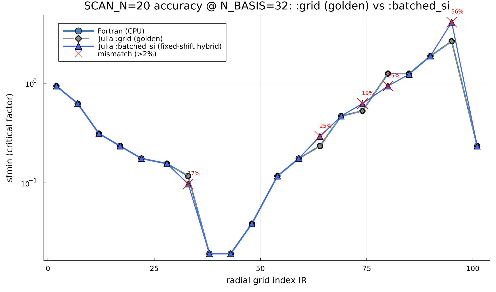
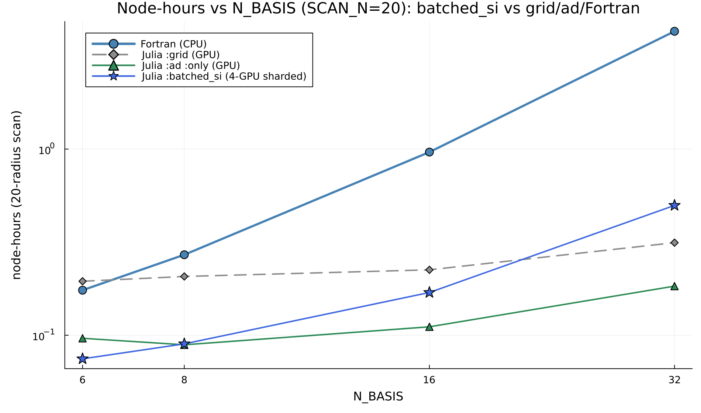

# Batched GPU eigensolver for the TJLFEP grid — attempt & post-mortem

**Status: NOT in production (default). `:grid`/`:threads` is NOT superseded by `:batched_si`.**
Four batched-GPU eigensolver variants were built and measured against the dense grid
(`inner=:threads`, CPU-threaded `geev`): fixed-shift SI (§2–4), adaptive-shift SI (§5.1–5.2), a
contour-integral (Sakurai–Sugiura Rayleigh–Ritz) solver (§5.3), and a coverage-**certified**
adaptive SI solver (§5.4). None of them supersedes the dense `:threads` path for the onset scan:
the fixed and adaptive schemes are not bit-exact (silent ion-leader misses at high drive); the
contour solver is safe but saturates on the near-axis mode crowd; and the certified solver, though
it makes coverage self-checking, ends up **3–10× slower than a properly-threaded dense solve** on
the hard high-drive radius and still is not bit-safe under multi-GPU sharding.

**The decisive measurement (§5.5):** the dense-`geev` baseline these efforts were racing against
(~4100 ms/pencil, ~125 s for the 1024-pencil IR101 batch) was itself an artifact of **OpenBLAS
thread oversubscription**. Pinning `BLAS.set_num_threads(1)` and giving each core one Julia thread
(pencil-parallel `geev`) cuts the full 1024-pencil batch to **~20 s** — bit-exact, always safe, and
faster than every batched variant on IR101. This reframes the whole effort: the onset scan should
keep using `:grid`/`:threads` (including the 5-node MPS layout), which the batched GPU eigensolvers
do not beat. The GPU remains valuable elsewhere in the pipeline; it just does not win this dense,
non-symmetric, `n≈720` batched eigenproblem.

The code for all four variants is kept (behind opt-in flags; default behavior is bit-for-bit
unchanged) as reusable eigensolvers and a record of what was tried — see "Code map" below.

---

## 1. Motivation

The `:grid` solver (`kwscale_scan`) evaluates a `(kyhat × width × factor)` grid and, for the
onset scan (`IFLUX=false`), only consumes the **few most-unstable eigenvalues** of each `(A,B)`
generalized pencil. The dense solve is `gesv!` + `geev!` (LAPACK) on CPU, or `getrf/getrs` +
cuSOLVER `Xgeev` on GPU.

The GPU path is bottlenecked by `Xgeev`:

- `Xgeev` is ~98% of every GPU eigensolve;
- it **cannot be batched** (no strided/batched general nonsymmetric eig in cuSOLVER); and
- it is **not concurrency-safe** within a single CUDA context (concurrent `Xgeev` from multiple
  host threads/streams corrupts results / crashes).

So the dense GPU path is forced *serial* — one `Xgeev` at a time — which loses to the
CPU-threaded grid and to Fortran `srun -n 1280`. The idea: since TJLFEP only needs the dominant
(most-unstable) modes, replace `Xgeev` with a **shift-invert subspace iteration** whose every step
is a *batched* cuBLAS primitive, so `P` pencils are processed in one kernel-launch sequence per
shift and the A100 stays busy.

---

## 2. What was built

### 2.1 Batched shift-invert subspace iteration
`TJLF/src/tjlf_batched_si.jl` (`SIConfig`, `si_eigvals_batch`) + GPU kernels in
`TJLF/ext/TJLFCUDAExt.jl` (`_si_batch`, `_si_shift!`, `_si_gather_rows!`, `_si_cholqr!`).

For each shift `σ`, over the whole batch of `P` pencils at once:

```
G   = A - σB                                   (broadcast)
G   = LU(G)                                     (getrf_strided_batched!)
S x = U⁻¹ L⁻¹ P (B x)                           (gemm + pivot-gather kernel + trsm_batched! ×2)
Q steps of M-dim subspace iteration:  X ← orth(S X)   (Cholesky-QR: only the M×M Gram crosses PCIe)
Rayleigh-Ritz:  T = Xᴴ S X  (M×M, tiny host eig) → μ → λ = σ + 1/μ
```

Results are unioned over shifts and deduped. Key implementation choices:

- **`trsm` block-solve, not explicit inverse.** `getrs_strided_batched!` segfaults in this cuBLAS
  build, and `getri` (explicit inverse) is ~2.5 n³/shift. Factor `G` once and apply
  `S = U⁻¹L⁻¹P(B·)` to the `n×M` block → ~1 n³/shift.
- **Cholesky-QR orthonormalization**, GPU-resident: only the `M×M` Gram/`R⁻¹` cross PCIe, the
  `n×M` block stays on the device (avoids a per-iteration host QR transfer).
- **Fixed shift set** (13 shifts) covering the physically expected unstable window
  (ion branch `imag(λ)` up to ~1.5; a dense electron cluster hugging the real axis, `|freq|≲0.12`).

### 2.2 Grid integration (opt-in)
- `TJLF/src/tjlf_eigensolver.jl`: `const _EIGSOLVE_HOOK` — when set, `_standard_eigenvalues_via_solve`
  routes the pencil to the hook instead of the dense solve (only the eigenvalue-only path;
  `nothing` by default so standard behavior is unchanged).
- `TJLFEP/src/tjlfep_kwscale_scan.jl`: `inner=:batched_si` — a two-phase **collect → batched-solve →
  replay** driver that gathers pencils across grid combos and solves them in one GPU sweep, plus a
  **hybrid** (dense endpoints for localization/pinning, SI on intermediate rounds) and a
  **per-radius dense fallback** (`si_dense_fallback`, `si_fallback_ratio`).

---

## 3. Measured performance (the good part)

On real harvested TJLF pencils (`benchmark_batched_si_gpu.jl`), nb16, `n=720`, 1024 pencils:

| metric | value |
|---|---|
| CPU `geev` (1 thread) | ~4100 ms/pencil |
| GPU batched SI (13 shifts) | ~13 ms/pencil |
| **per-pencil speedup** | **~300×** |
| concurrency-safe / batched | yes (unlike `Xgeev`) |

As a raw dominant-eigenvalue accelerator the method is excellent.

---

## 4. Why it does NOT work for the grid (the failure)

### 4.1 The symptom
Full 20-radii end-to-end at the **real** grid resolution (`nfactor=8, nefwid=8, nkyhat=4,
k_max=4`), nb16, `:batched_si` (hybrid + fallback) vs `:threads` (dense golden):

- **13/20 radii mismatched**; ~10 were *real* sfmin errors (not tie-breaks).
- **Catastrophic at IR101**: golden `sfmin=0.18` vs batched-SI `sfmin=4.13` (**22×**).

The same failure persists at the production basis size **nb32** — `:batched_si` (fixed-shift hybrid)
misses **5/20 radii by >2%**, up to **+55% at IR95**, the most strongly EP-driven edge radius. The
Fortran and Julia `:grid` curves are bit-for-bit identical (they trace one another); `:batched_si`
departs precisely where the drive is highest (the rising right branch, IR ≳ 60):



### 4.2 Why the earlier "E2E_OK" was misleading
The earlier validation used `k_max=2`. The hybrid runs dense endpoints (localize `k=1`, pin
`k=k_max`) and SI only on *intermediate* rounds — **at `k_max=2` there are no intermediate rounds,
so it was 100% dense and never exercised SI at all.** The full-grid `k_max=4` run is the first time
SI actually drove localization, and it fails.

### 4.3 Root cause (diagnosed, not guessed)
Harvesting IR101's actual 1024 grid pencils and running **pure `geev` vs batched-SI** (no kwscale
wiring in the loop), with the exact e2e config (M=16, Q=12, 13-shift set, trsm+cholqr):

```
ion leader : MISSED 333/503   |dgamma| median 3.8e-3  max 0.366
ele leader : MISSED   1/521   |dgamma| median 2.3e-6  max 0.215
top-4 |dλ| : median 0.102      max 6.98
```

**The batched SI misses the ion-branch leader in 66% of IR101's pencils.** IR101 is strongly
EP-driven (`factor_in = 10.0`); at high drive the ion/AE modes move to eigenvalue locations the
**fixed** shift set does not cover, so shift-invert never amplifies them. The grid then classifies
those combos as *stable* → the marginal factor is pushed far above the true value.

This is **fundamental**, not a wiring bug: the pure eigensolver comparison had no kwscale code in
the loop.

### 4.4 The general problem
A fixed-shift SI must cover an **a-priori-unknown, drive-dependent** spectrum. Because the grid's
answer is an **argmin over the factor axis of a `γ(f) ≷ γ*` classification**, *any single missed
leader flips a combo from unstable→stable and corrupts the result.* The earlier "0 misses" tuning
was done on moderate-drive pencils, which is exactly why it looked clean. Covering the full ion
branch across all drives with fixed shifts would require many more shifts; cost scales with shift
count, pushing SI back toward `geev`'s cost and erasing the win.

The fallback heuristic (`marginal > 1.5×nominal → redo dense`) does **not** rescue this: the true
marginal can be far *below* nominal (IR101: nominal factor 10, true marginal 0.18), so a wrong
high marginal doesn't always trip the guard.

### 4.5 …and at production resolution it isn't even faster than the dense grid
Setting accuracy aside, the *cost* argument also collapses at the basis size that matters. Measuring
**node-hours for the full 20-radius scan** (the metric used in `docs/plots/scan20_timing.csv`), with
the 20 radii sharded across the 4 A100s on one node:



| N_BASIS | `:batched_si` (1-node, 4-GPU) | `:grid` GPU (5-node MPS) | `:ad :only` GPU (5-node MPS) | Fortran CPU |
|--------:|------------------------------:|-------------------------:|----------------------------:|------------:|
| 6  | 0.075 | 0.195 | 0.096 | 0.175 |
| 8  | 0.090 | 0.207 | 0.089 | 0.271 |
| 16 | 0.170 | 0.225 | 0.111 | 0.964 |
| 32 | **0.498** | **0.314** | 0.184 | 4.294 |

(`:grid`/Fortran/`:ad :only` node-hours are the authoritative values from the main
[`TJLFEP/README`](../README.md#benchmark-cost-vs-n_basis-diii-d-scan_n20) benchmark — `:ad :only` is
parsed from the same pinned 5-node run logs, so this curve matches the README's node-hours plot
exactly. Node-hours = nodes × wallclock is layout-independent, so the 1-node/4-GPU `:batched_si` is
directly comparable to the 5-node tiers. `:ad :only` *grows* with `N_BASIS` — bigger AD/confirm
regions — it is **not** flat. Note `:ad :only`, like `:grid`, uses the 5-node MPS layout because its
per-radius cost is uniform; only `:ad :locate`/`:ad :wide` use a 1-node backfill.)

`:batched_si`'s per-scan cost grows steeply with basis size (each of the 13 shifts does a batched
`n³` LU + block solve with `n = 45·nbasis`, and the hardest radii fall back to dense), so it
**crosses above both `:grid` GPU *and* `:ad :only` at nb32 — slower *and* wrong**. It only wins at
small nb (nb6–8, where its solves are cheap); by nb32 it costs ~1.6× `:grid` and ~2.7× `:ad :only`.
A dynamic **work-stealing backfill** layout for `:batched_si` (4 processes draining a shared queue)
was tried to reclaim the straggler imbalance but landed within ~1% of the static shard (nb32: 0.496
vs 0.498 node-hours) — the cost is straggler-bound (two edge radii at ~590 s vs ~280 s typical), not
assignment-bound, so no scheduling change rescues it.

---

## 5. Adaptive-shift salvage attempt

Idea: instead of a fixed shift set, **derive shifts from the actual spectrum** — `geev` a cheap
strided calibration subset (~5–10% of the batch), collect the observed branch leaders (top-2 ion
`imag>0` + top-2 electron `imag≤0` per pencil), cluster them in the complex plane, and place a
shift at each cluster centroid. Coverage then tracks the drive level automatically. The batch is
also sharded across all 4 A100s per GPU node (`CUDA.device!` per spawned task).

Prototype: `benchmark_adaptive_si_gpu.jl` (fixed vs adaptive leader-miss counts on IR101's real
pencils) + `batch_adaptive_si_gpu.sh` / `batch_adaptive_si_union_gpu.sh`.

### 5.1 Iteration 1 — redistribute a fixed shift budget (IR101, 1024 pencils, 10% calibration)

| shift scheme | ion missed | ele missed | total |
|---|---|---|---|
| fixed 13-shift | 336/503 | 1/521 | 337 |
| adaptive (13 shifts, redistributed) | **78/503** | **112/521** | 190 |

Adaptive shifting **fixed the ion branch** (336→78) but **broke the electron branch** (1→112): a
fixed ~13-shift budget cannot simultaneously cover the *spread-out* high-drive ion modes and the
*dense near-axis* electron cluster — clustering collapses the electron band that the fixed set
covered with 5 dedicated shifts. Net 337→190 misses: much better, but nowhere near the ~0 a
bit-exact grid needs. (Fewer calibration pencils made it worse: 5% → 232 misses.)

**Multi-GPU:** sharding 1024 pencils over 4 A100s gave ~2.9× throughput (17.8 → 6.2 ms/pencil);
net speedup over full `geev` including 10% calibration was ~7× (≈11× at 5% calibration).

### 5.2 Iteration 2 — union (fixed electron band + *added* adaptive ion shifts)

Rather than redistribute, **keep the full fixed near-axis band** (guarantees electron coverage) and
**append** adaptive ion-branch shifts on top, up to a larger budget (`UNION_FIXED=1`,
`MAXSHIFTS=32/48`). This works: electron misses stay ~0–1 while ion misses collapse.

| shift scheme (IR101, 1024 pencils, 10% calib) | ion missed | ele missed | total | ms/pencil (4×A100) |
|---|---|---|---|---|
| fixed 13-shift | 338/503 | 1/521 | 339 | 5.7 |
| **union: 13 fixed + 12 adaptive ion = 25 shifts** | **8/503** | **0–1/521** | **8–9** | 8.9 |

The union scheme drops total leader misses **337 → ~8** (a 97.6% reduction) with the residual γ
errors tiny (median ~1e-7, max ~0.06). Raising the budget from 32→48 didn't add shifts (the 10%
calibration only found 25 distinct clusters), so the residual 8 ion misses are the hardest modes
not represented in the calibration sample, not a coverage-budget limit. Net speedup over full
`geev` (including the 10% calibration) was ~5.8× on 4 A100s.

**Assessment:** the adaptive-union batched SI is now *close* to grid-exact (≈99.2% of leaders
recovered) but **not bit-exact** — 8 residual ion misses out of 1024 pencils would still flip 8
grid combos. It is a viable **opt-in accelerator paired with a dense confirm**, but not a
drop-in bit-exact replacement for the dense grid. Closing the last ~8 misses would need a richer
calibration (higher fraction, or calibrating from the extreme-drive combos specifically) and/or a
cheap dense re-check of the handful of combos where SI returns no strong ion mode.

The residual-8 problem is a *coverage-by-sampling* failure: the calibration `geev` subset never
saw the hardest ion modes, so no shift was placed near them. The next two variants attack coverage
directly, without a calibration sample.

---

## 5.3 Contour-integral solver (Sakurai–Sugiura Rayleigh–Ritz)

Idea: stop guessing shifts and instead find **all** eigenvalues inside a chosen window by numerical
contour integration of the resolvent. `TJLF/src/tjlf_batched_si.jl` (`ContourConfig`,
`contour_eigvals_batch`) with GPU moments in `TJLFCUDAExt.jl` (`_contour_moments`) builds moments
`M_k = (1/2πi) ∮ φ(z)^k (zB−A)^{-1} B V dz` over a rectangular window using Gauss–Legendre
quadrature (each node = one batched LU + block solve, the exact same primitives as SI), then an SVD
of the stacked moments gives a subspace `U` and a small `eigen(UᴴAU, UᴴBU)` yields the eigenvalues;
each is residual-certified and the pencil is flagged for dense fallback if the subspace saturates.

**Result (real IR pencils, CPU SS-RR validation):** *safe but ineffective*. Measured on 8 real
720-dim pencils, every pencil flagged and only 0–4 eigenvalues certified per pencil:

```
in-window counts: [28,72,42,46,33,76,68,26]   capacity 2KL = 384
ranks:            [357,339,348,350,353,322,333,361]   (of 384)
found (certified): 0–4 per pencil ; all 8 pencils flagged
```

The cause is physical: TJLF spectra have a **quasi-continuum of ~100+ weakly damped modes hugging
γ≲0**, so any contour boundary near the axis runs straight through a mode crowd. With ~48 quadrature
nodes the resolvent poles near the boundary are unresolved, quadrature leakage floods the moment
subspace (ranks ~350/384), and almost nothing certifies. There is **no spectral gap** in which to
place a contour, and brute-forcing enough nodes to resolve the crowd costs more than the dense
solve. Correct-by-construction, but useless here.

## 5.4 Coverage-certified adaptive SI

Idea: keep the fast SI kernel, but make coverage **self-certifying per pencil** instead of relying
on a calibration sample. `TJLF/src/tjlf_batched_si.jl` (`CertifiedSIConfig`,
`certified_si_eigvals_batch`) with a persistent batched GPU handle (`_csi_open` in
`TJLFCUDAExt.jl`) that applies a **per-pencil** shift vector (`G = A − σ_p B`) in one batched sweep
and returns Ritz values *and* their on-device residuals. Guarantees:

1. **residual certification** — only Ritz pairs with `‖Ax−λBx‖/(‖Ax‖+|λ|‖Bx‖) ≤ 1e-8` are returned;
2. **geometric coverage certificate** — each shift owns a disk (radius = distance to its trust-th
   enumerated Ritz value, capped at the nearest un-enumerated one, plus an emptiness disk from the
   nearest Ritz distance); the unstable window is paved by cells and a cell is covered only when a
   disk contains it **entirely** (no inter-point gaps — an early point-grid check lost a crowd mode
   exactly that way);
3. **adaptive shifts** — uncovered cells spawn new per-pencil shifts (batched rounds, compacted onto
   the still-uncovered subset);
4. **dense fallback** — pencils still uncovered, or with candidates that resist refinement, are
   flagged and re-solved by exact dense `geev`.

This *works as designed for safety*: on 24 real nb16 pencils it recovers every in-window unstable
mode (or flags), zero spurious values, leaders exact to ~1e-9, flag rate 3–12/24. **But on the hard
IR101 case it is uneconomical** (`benchmark_certified_si_gpu.jl`, 1024 pencils, factor-10 drive,
window widened to `|ω|≤7` so the audit shows `0/2509` consumed modes outside it):

| arm | wall / pencil | flagged→dense | speedup vs threaded `geev` | silent misses |
|---|---|---|---|---|
| NGPU=1 | 166 ms | 841/1024 | **0.1×** | 0 |
| NGPU=4 | 71 ms | 827/1024 | **0.3×** | **2** |
| NGPU=4, cheaper budget | 87 ms | 974/1024 | 0.2× | 0 |

- **76–108 shifts/pencil** are needed to cover the near-axis crowd, and ~80% of pencils still have
  crowd modes that resist 1e-8 certification and fall back to dense anyway → net **3–10× slower**
  than the dense baseline.
- The NGPU=4 default arm produced **2 silent misses** (unflagged wrong electron leaders) while the
  NGPU=1 and cheaper-budget arms had 0 — so the coverage/trust heuristic + multi-GPU sharded path is
  **not robustly bit-safe** either.

## 5.5 The reframe: the dense baseline was never the bottleneck it appeared to be

Every variant above was racing a dense `geev` baseline quoted at **~4100 ms/pencil / ~125 s for the
1024-pencil IR101 batch**. That number was an **OpenBLAS thread-oversubscription artifact**: the
benchmark drove `Threads.@threads` over pencils while OpenBLAS *also* spawned a full thread pool per
call, so 32 Julia threads × an OpenBLAS pool oversubscribed the 64-core host and busy-waited in
`blas_thread_server` (observed via a native backtrace: 95 threads at 99% CPU with all GPUs idle).

The fix is one line — pin `BLAS.set_num_threads(1)` and give each core one Julia thread so `geev`
runs single-threaded but 64-way pencil-parallel:

| dense `geev`, 1024 IR101 pencils | wall |
|---|---|
| naive (Julia threads × OpenBLAS pool, oversubscribed) | ~125 s |
| **BLAS=1, one Julia thread/core (64-way pencil-parallel)** | **~20 s** |

At ~20 s the exact, always-safe dense solve is **faster than every batched variant on IR101** and
carries no silent-miss risk. GPU dense eigensolve is not competitive for this problem: cuSOLVER
`Xgeev` is not concurrency-safe intra-context (must run serially) and has no batched form, so 64-way
CPU parallelism beats it. The onset scan should therefore keep `:grid`/`:threads` (including the
5-node MPS layout); the GPU is better spent on the parts of the pipeline that actually benefit.

---

## 6. Recommendation

- **Production onset scan:** keep the **bit-exact dense grid** (`inner=:threads`) — it is exactly
  correct, always safe, and (with `BLAS.set_num_threads(1)` + one Julia thread per core, §5.5)
  faster than every batched GPU variant on the hard high-drive radius: ~20 s for the 1024-pencil
  IR101 batch. **`:grid`/`:threads` is not superseded by `:batched_si`.** Keep the 5-node MPS layout
  for the full scan and scale with exact argmin-preserving column pruning + `Distributed`.
- **Always pin BLAS threads to 1** in any pencil-parallel dense path (`Threads.@threads` + `geev`).
  Otherwise OpenBLAS oversubscribes the cores and the dense solve looks ~6× slower than it is — the
  false bottleneck that motivated the batched effort in the first place (§5.5).
- **Batched SI / contour / certified SI:** keep as **optional, non-authoritative accelerators**
  only. None is bit-exact and safe *and* faster than the tuned dense grid on IR101, so none should
  be enabled by default. If any is used, pair it with a dense confirmation of the winning
  configuration and never trust it to classify near-marginal combos.
- **Adaptive-union SI (§5.2)** remains the best *accuracy/speed* batched variant (≈99.2% of leaders,
  ~6× over the *oversubscribed* geev) — but note that number is against the inflated baseline; vs the
  tuned ~20 s dense solve the margin largely evaporates.
- **Certified SI (§5.4)** is the right design if a *self-certifying* GPU eigensolver is ever needed
  (no calibration sample, per-pencil coverage proof), but on the near-axis crowd it needs 76–108
  shifts/pencil and flags ~80% to dense, so it loses to the tuned dense solve here.
- **GPU still matters elsewhere.** This conclusion is specific to the dense, non-symmetric,
  `n≈720` *batched eigenproblem*. Other pipeline stages (and the `:grid`/`:ad` GPU MPS layouts)
  continue to benefit from the A100s.
- **Multi-GPU** sharding (`CUDA.device!` per spawned task over the 4 A100s per node) is implemented
  and reusable; note the certified-SI sharded path showed 2 silent misses on IR101 (§5.4), i.e. it
  is not yet bit-safe under concurrency.

---

## 7. Code map

| Component | Location | Notes |
|---|---|---|
| `SIConfig`, `si_eigvals_batch`, CPU fallback | `TJLF/src/tjlf_batched_si.jl` | fixed-shift SI, first-class API + unit test |
| `ContourConfig`, `contour_eigvals_batch` (§5.3) | `TJLF/src/tjlf_batched_si.jl` | SS-RR contour solver (rect window, GL quadrature) |
| `CertifiedSIConfig`, `certified_si_eigvals_batch` (§5.4) | `TJLF/src/tjlf_batched_si.jl` | coverage-certified adaptive SI + `_CSICover` cell paving |
| GPU batched SI kernels (`_si_batch`, …) | `TJLF/ext/TJLFCUDAExt.jl` | trsm block-solve + Cholesky-QR |
| GPU contour moments (`_contour_moments`) | `TJLF/ext/TJLFCUDAExt.jl` | batched resolvent moments, memory-sharded |
| GPU certified-SI handle (`_csi_open`, `_csi_cholqr!`, `_csi_maxp`) | `TJLF/ext/TJLFCUDAExt.jl` | persistent per-pencil-shift handle + on-device residuals |
| eigensolve hook | `TJLF/src/tjlf_eigensolver.jl` (`_EIGSOLVE_HOOK`) | opt-in; default `nothing` (unchanged) |
| pencil dumping (offline benchmarking) | `TJLF/src/tjlf_eigensolver.jl` (`_maybe_dump_pencil`, `TJLF_DUMP_PENCILS`) | harvest real `(A,B)` |
| grid wiring | `TJLFEP/src/tjlfep_kwscale_scan.jl` (`inner=:batched_si`, `si_method=:contour`/`:certified`) | collect/solve/replay + hybrid + fallback |
| unit tests | `TJLF/test/runtests_batched_si.jl` | SI + contour + certified-SI on controlled spectra |
| benchmarks / diagnostics | `TJLFEP/build/ad/benchmark_batched_si_gpu.jl`, `benchmark_adaptive_si_gpu.jl`, `benchmark_contour_gpu.jl`, `benchmark_certified_si_gpu.jl`, `compare_batched_si_e2e.jl`, `harvest_radius_pencils.jl` | + `batch_*_gpu.sh` drivers |
| CPU/GPU validators (§5.3–5.4) | `TJLFEP/build/ad/_test_contour_cpu_real.jl`, `_test_contour_gpu.jl`, `_test_csi_cpu_real.jl`, `_test_csi_gpu.jl` | real-pencil + GPU-vs-CPU agreement (`batch_csi_cpu_tests.sh`, `batch_certified_si_gpu.sh`) |
| node-hours drivers (fig §4.5) | `TJLFEP/build/ad/run_batched_si_sfmin.jl` (+`batch_batched_si_nodehours_gpu.sh`, static shard), `run_batched_si_backfill_worker.jl` (+`batch_batched_si_backfill_gpu.sh`, work-stealing) | 4-GPU shard vs dynamic backfill |
| plots (`docs/plots/`) | `TJLFEP/build/ad/plot_batched_si_accuracy_nb32.jl`, `plot_batched_si_nodehours.jl` | regenerate the two README figures |

## 8. Key lessons
1. An approximate eigensolver that is accurate "on average" is **unsafe** to drive a discrete argmin
   where a single missed dominant mode changes the classification. Validate such solvers on the
   **actual, worst-case operating points** (here: high-drive radii like IR101), not on a
   representative-looking sample — and make sure the validation harness actually exercises the
   approximate path (the `k_max=2` degenerate-to-dense case hid the failure for a long time).
2. **Benchmark the baseline as carefully as the new method.** The entire batched-eigensolver effort
   was motivated by a ~125 s dense baseline that was really OpenBLAS thread oversubscription; the
   true tuned baseline (`BLAS.set_num_threads(1)`, one Julia thread/core) is ~20 s and beats every
   batched variant on the hard case. Always pin BLAS to 1 thread inside `Threads.@threads` + LAPACK
   loops, and confirm the accelerator actually beats a *well-configured* baseline, not a hobbled one.
3. **The GPU is not always the right tool.** For a dense, non-symmetric, `n≈720` batched
   eigenproblem, cuSOLVER `Xgeev` is serial-only (not concurrency-safe) with no batched form, and the
   shift-invert/contour reformulations founder on TJLF's near-axis mode crowd. 64-way CPU pencil
   parallelism wins. Reserve the A100s for the pipeline stages that genuinely benefit.
